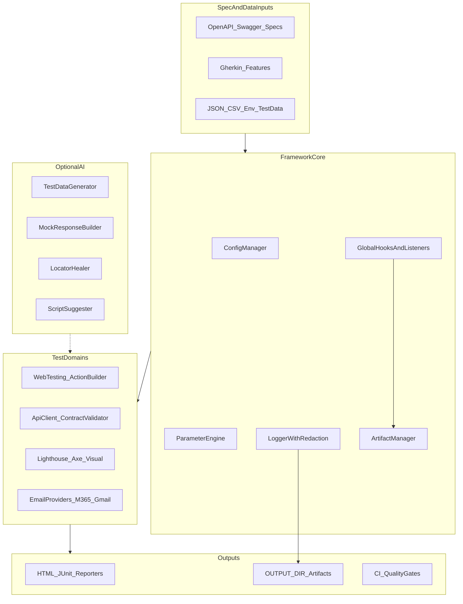
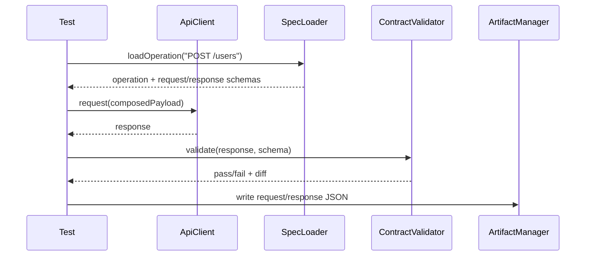

# Enterprise Playwright Test Automation Framework — Design Plan

**Target workspace:** `C:\Users\uhanu\WorkspaceAI\enterprise-playwright-framework`

**Current state:** All phases implemented. The framework is fully built: config/params/logging/artifacts, extended `testBase` fixtures + auto hooks, JSON utils, web (ActionBuilder/FormPopulator/listeners), API (OpenAPI spec loader/client/contract validation), quality (Lighthouse/Axe/visual), email providers (M365/Gmail), security scan, AI modules behind `ENABLE_AI`, playwright-bdd setup, CI templates, and sample suites (14 Playwright + 2 BDD tests green). See `[README.md](../../README.md)`.

**Related references:**

- `[framework-req.md](framework-req.md)` — formal requirements (includes test data, locator, runtime store, and Form Populator specs)
- `[sample-files-to-refere.md](sample-files-to-refere.md)` — original sample drafts (superseded by `framework-req.md`)

---

## Design Principles

1. **Layered architecture** — config → core runtime → domain helpers (web/api/data) → tests
2. **Playwright-native first** — extend `@playwright/test` fixtures/hooks rather than wrapping the runner
3. **Spec-driven** — OpenAPI specs and Gherkin features are first-class inputs, not afterthoughts
4. **Observable by default** — traces, screenshots, network captures, structured logs land in a single `OUTPUT_DIR`
5. **AI is optional** — isolated under `src/ai/` with feature flags; zero runtime dependency when disabled

---


## High-Level Architecture




---


## Proposed Project Structure

```
enterprise-playwright-framework/
├── framework-req.md
├── framework-design-plan.md
├── README.md
├── package.json
├── tsconfig.json
├── playwright.config.ts
├── playwright.bdd.config.ts          # BDD entry (playwright-bdd)
├── .env.example
├── .github/workflows/ci.yml
├── azure-pipelines.yml
├── Jenkinsfile
├── config/
│   ├── environments/
│   │   ├── dev.json
│   │   ├── qa.json
│   │   └── prod.json
│   └── defaults.json                 # base URLs, timeouts, feature flags
├── specs/
│   └── openapi/                      # checked-in or referenced API specs
├── test-data/
│   ├── global/                       # env-agnostic datasets
│   └── {env}/                        # env overlays (dev/, qa/)
├── features/                         # Gherkin .feature files
├── tests/
│   ├── web/                          # Playwright spec tests
│   ├── api/                          # API contract tests
│   ├── quality/                      # lighthouse, axe, visual
│   └── steps/                        # BDD step definitions
├── src/
│   ├── index.ts                      # public barrel exports
│   ├── config/
│   │   ├── env.ts                    # .env + process.env loader
│   │   ├── manager.ts                # merge defaults + env JSON + overrides
│   │   └── secrets.ts                # credential resolution (env/vault hooks)
│   ├── framework/
│   │   ├── testBase.ts               # extended test + fixtures
│   │   ├── hooks.ts                  # global setup/teardown, listeners
│   │   ├── artifactManager.ts        # OUTPUT_DIR layout + run metadata
│   │   └── dataProvider.ts           # JSON/CSV/text/env data-driven loader
│   ├── web/
│   │   ├── actionBuilder.ts          # fluent ActionBuilder workflow engine
│   │   ├── basePage.ts               # shared page object base
│   │   ├── formPopulator.ts          # data + locator driven form fill (Form.io)
│   │   └── listeners/
│   │       ├── networkRecorder.ts    # HAR/cURL/JSON/Node export
│   │       ├── traceManager.ts
│   │       └── screenshotManager.ts
│   ├── api/
│   │   ├── apiClient.ts              # request composition wrapper
│   │   ├── contractValidator.ts      # OpenAPI + JSON Schema validation
│   │   ├── responseAssertions.ts     # status, timing, required fields
│   │   └── specLoader.ts             # Swagger/OpenAPI parse + operation lookup
│   ├── quality/
│   │   ├── lighthouseRunner.ts
│   │   ├── axeRunner.ts
│   │   └── visualRegression.ts
│   ├── utils/
│   │   ├── json/                     # split by concern (see JSON module below)
│   │   ├── file.ts
│   │   ├── csv.ts
│   │   ├── zip.ts
│   │   ├── encode.ts
│   │   ├── date.ts
│   │   ├── parameters.ts
│   │   ├── output.ts
│   │   └── email/
│   │       ├── provider.ts           # interface
│   │       ├── microsoft365.ts
│   │       └── googleWorkspace.ts
│   ├── logging/
│   │   ├── logger.ts
│   │   └── redactor.ts
│   ├── security/
│   │   └── scan.ts                   # npm audit + optional SAST hook
│   └── ai/                           # all behind ENABLE_AI=true
│       ├── index.ts
│       ├── testDataGenerator.ts
│       ├── mockResponseBuilder.ts
│       ├── locatorHealer.ts
│       └── scriptSuggester.ts
└── scripts/
    ├── quality-gate.ts               # exit-code gate for CI
    └── generate-api-tests.ts         # optional OpenAPI → test scaffold
```

---


## Core Runtime Design


### 1. Configuration & Multi-Environment

**Approach:** Layered config merge: `defaults.json` → `config/environments/{ENVIRONMENT}.json` → `.env` → CLI/env vars.


| Variable                   | Purpose                                        |
| -------------------------- | ---------------------------------------------- |
| `ENVIRONMENT`              | Selects env JSON overlay (`dev`, `qa`, `prod`) |
| `OUTPUT_DIR`               | Root artifact directory (default: `output/`)   |
| `LOG_LEVEL`                | Global log verbosity                           |
| `REDACT_SECRETS`           | Enable log/report redaction                    |
| `WORKERS`                  | Parallel worker count                          |
| `ENABLE_AI`                | Toggle optional AI modules                     |
| `BASE_URL`, `API_BASE_URL` | Per-env endpoints                              |


**Test-specific data:** `test-data/global/{suite}.json` merged with `test-data/{env}/{suite}.json` at load time via `src/framework/dataProvider.ts`.

**Runtime data store:** Per `[sample-files-to-refere.md](sample-files-to-refere.md)`, support a `runTimeDataStore.json` pattern with env-scoped sections (`dev`, `qa`) containing:

- `global` — shared runtime values (token, baseUrl)
- `{testName}` — test-specific dynamic IDs and state

The config manager loads and merges this store so tests can read/write runtime values across steps.

### 2. Parameter Engine

Replace static tokens with a registry-based resolver in `src/utils/parameters.ts`:

- **Date tokens:** `{{TODAY}}`, `{{TODAY+N}}`, `{{TODAY-N}}`, `{{NOW}}`, `{{NEXT_MONTH}}`
- **Env tokens:** `{{ENV.BASE_URL}}`, `{{ENV.API_KEY}}`
- **Runtime tokens:** `{{RUN_ID}}`, `{{TEST_NAME}}`, `{{RUNTIME.test_1.id}}`
- **Inline expressions:** `{{DATE:yyyy-MM-dd:+7}}` via `date-fns`

Resolution runs recursively over JSON/CSV/string payloads before test execution.

### 3. Extended Playwright Test Base

`src/framework/testBase.ts` exports `test` and `expect` extended with fixtures:

```typescript
// Fixtures injected into every test
frameworkConfig   // merged env config
frameworkLogger   // redacting logger scoped to test
artifactManager   // run-scoped output paths
apiClient         // pre-configured API client
actionBuilder     // factory bound to current page
dataProvider      // loaded + resolved test data
formPopulator     // data + locator driven page fill
```

`src/framework/hooks.ts` registers:

- **globalSetup** — create run folder `{OUTPUT_DIR}/{runId}/{env}/`
- **beforeEach** — start network recorder (if enabled), log test start
- **afterEach** — capture screenshot on failure, stop recorder, write artifacts
- **onTestEnd listener** — attach trace metadata, zip artifacts on demand


### 4. OUTPUT_DIR Layout

```
output/
└── {runId}/
    └── {environment}/
        ├── logs/
        ├── traces/
        ├── screenshots/
        ├── snapshots/
        ├── network/          # cURL, .har, request/response JSON
        ├── reports/          # HTML, JUnit XML
        └── {suiteName}/
```

Run ID = timestamp + short hash, generated once in globalSetup.

---


## Web Testing — ActionBuilder Pattern

`src/web/actionBuilder.ts` implements a fluent, chainable workflow API:

```typescript
await actionBuilder(page)
  .navigate('/login')
  .fill('#username', data.username)
  .fill('#password', data.password)
  .click('button[type=submit]')
  .waitForNavigation()
  .assertVisible('.dashboard')
  .screenshot('post-login')
  .execute();
```

**Design:**

- Each action is a typed step object pushed to a queue
- `execute()` runs steps sequentially with unified error context
- Steps are reusable: export/import action sequences as JSON for data-driven web flows
- Integrates with `artifactManager` for step-level screenshots and network snapshots

**Page Objects:** `src/web/basePage.ts` wraps common Playwright locators; ActionBuilder composes page objects for complex flows.

**Listeners** (under `src/web/listeners/`):

- `networkRecorder.ts` — intercept requests/responses, filter by URL pattern, export as cURL / fetch snippet / JSON
- `traceManager.ts` — wrap Playwright tracing start/stop with OUTPUT_DIR paths
- `screenshotManager.ts` — named screenshots with test/step metadata

---


## Form Populator (Data + Locator Driven)

Per `[sample-files-to-refere.md](sample-files-to-refere.md)`, implement `src/web/formPopulator.ts` — a method that accepts locator metadata and test data, then populates a page based on field type.

**Locator metadata format** (`locators-signup.json`):

```json
{
  "firstName": { "locator": "xpath-to-firstName", "type": "textbox" },
  "lastName":  { "locator": "css-to-lastname",    "type": "textbox" },
  "email":     { "locator": "regex-to-email",     "type": "textbox" },
  "age":       { "locator": "getByLabel('Age')",  "type": "textbox" },
  "gender":    { "locator": "xxxxx",              "type": "radio" },
  "country":   { "locator": "xxxxx",              "type": "dropdown" }
}
```

**Test data format** (`test-data-signup.json`):

```json
{
  "firstName": "John",
  "lastName": "Doe",
  "email": "JohnDoe@mailinator.com",
  "age": "21",
  "gender": "male",
  "country": "India"
}
```

**Supported field types and actions:**


| Type       | Playwright action                        |
| ---------- | ---------------------------------------- |
| `textbox`  | `fill()`                                 |
| `textarea` | `fill()`                                 |
| `dropdown` | `selectOption()`                         |
| `radio`    | `check()` / click matching label         |
| `checkbox` | `check()` / `uncheck()`                  |
| `click`    | `click()` (action-only entry, no value)  |
| `wait`     | `waitForTimeout()` / `waitForSelector()` |


**API:**

```typescript
await formPopulator(page, locators, testData, {
  skipEmpty: true,       // skip fields with no value in test data
  resolveParams: true,   // run parameter engine on values first
  onFieldError: 'fail'   // 'fail' | 'skip' | 'warn'
});
```

**Form.io support:** When form fields use unique element IDs matching test-data keys, locators can be auto-generated as `#${fieldKey}` if no explicit locator is provided. This enables zero-locator-json workflows for Form.io pages where IDs are stable.

**Interleaved actions:** Locator entries support optional `before` / `after` action arrays (click, wait, scroll) so population can handle multi-step UI flows without leaving the populator API.

---


## API Testing — OpenAPI Contract Validation




**Key modules:**


| Module                          | Responsibility                                                           |
| ------------------------------- | ------------------------------------------------------------------------ |
| `src/api/specLoader.ts`         | Parse OpenAPI 3.x via `@apidevtools/swagger-parser`; resolve `$ref`      |
| `src/api/apiClient.ts`          | Wrap Playwright `APIRequestContext`; auth headers, base URL, timing      |
| `src/api/contractValidator.ts`  | Validate body against JSON Schema (from spec) via `ajv`; diff on failure |
| `src/api/responseAssertions.ts` | Status code, response time SLA, required field presence, error schema    |


**Test authoring styles supported:**

1. **Spec-driven:** reference operationId/path — framework builds request template from spec
2. **Explicit:** hand-written request with optional schema override
3. **Generated scaffold:** `scripts/generate-api-tests.ts` creates starter specs from OpenAPI

---


## JSON Utilities Module

Implement comprehensive JSON ops per requirements. Split into focused files under `src/utils/json/`:


| File           | Operations                                                              |
| -------------- | ----------------------------------------------------------------------- |
| `parse.ts`     | parse, stringify, prettyPrint, minify, syntax validate                  |
| `transform.ts` | merge (shallow/deep), flatten/unflatten, project, map keys, purge nulls |
| `query.ts`     | JSONPath queries, key/value search, aggregation (sum/avg/min/max/count) |
| `patch.ts`     | diff, apply JSON Patch (RFC 6902), merge patch (RFC 7386)               |
| `validate.ts`  | JSON Schema validation via `ajv`                                        |
| `security.ts`  | field redaction, sanitization for logs                                  |
| `io.ts`        | readJsonFile, writeJsonFile, updateJsonFile, deleteJsonKeys             |


**Dependencies:** `ajv`, `jsonpath-plus`, `fast-json-patch`, `fast-deep-equal`

---


## Supporting Utilities


| Utility           | Implementation                                                                                                                                     |
| ----------------- | -------------------------------------------------------------------------------------------------------------------------------------------------- |
| **File/CSV**      | `src/utils/file.ts` — text read/write; `src/utils/csv.ts` — parse/generate via `csv-parse` / `csv-stringify`                                       |
| **Zip**           | `src/utils/zip.ts` — `adm-zip` for folder archive/extract (artifact packaging)                                                                     |
| **Encode/Decode** | `src/utils/encode.ts` — Base64, URL encode/decode; AES-256-GCM for secrets at rest (Node `crypto`)                                                 |
| **Date/Time**     | `src/utils/date.ts` — `date-fns` for offset, format conversion, timezone-aware generation                                                          |
| **Email**         | Provider interface + M365 (Microsoft Graph API) and Gmail (Google API) implementations; read inbox, download attachments, parse HTML via `cheerio` |


---


## Logging & Security

**Logger** (`src/logging/logger.ts`):

- Built on `pino` with pretty-print in local dev
- Global level from `LOG_LEVEL`; per-test override via fixture option
- Writes to `{OUTPUT_DIR}/logs/` and stdout

**Redaction** (`src/logging/redactor.ts`):

- Pattern-based masking (password, token, apiKey, authorization headers)
- Applied to log output, HTML report attachments, network capture exports
- Controlled by `REDACT_SECRETS=true`

**Credentials** (`src/config/secrets.ts`):

- Load from `.env` (gitignored), CI secret stores
- Never log raw values; expose only via parameter engine at resolution time

**Dependency scanning** (`src/security/scan.ts`):

- `npm audit --json` wrapper with configurable severity threshold
- Invoked in CI quality gate and available as `npm run security:scan`

---


## Performance & Quality Validation


| Check             | Library                                | Module                            |
| ----------------- | -------------------------------------- | --------------------------------- |
| Performance       | `playwright-lighthouse` + `lighthouse` | `src/quality/lighthouseRunner.ts` |
| Accessibility     | `@axe-core/playwright`                 | `src/quality/axeRunner.ts`        |
| Visual regression | Playwright `toHaveScreenshot()`        | `src/quality/visualRegression.ts` |


Each runner writes results JSON + screenshots to `{OUTPUT_DIR}/{runId}/quality/`.

---


## BDD / Gherkin Support

**Library:** [playwright-bdd](https://github.com/vitalets/playwright-bdd) — native Playwright integration, TypeScript step defs.

- Features in `features/`
- Step definitions in `tests/steps/`
- Separate config `playwright.bdd.config.ts` extending base config
- Step defs receive same fixtures (`apiClient`, `actionBuilder`, `dataProvider`, `formPopulator`) via Playwright-BDD fixture bridge
- HTML report includes Gherkin scenario names for stakeholder readability

---


## CI/CD & Quality Gates

**Templates to ship:**


| Platform        | File                       |
| --------------- | -------------------------- |
| GitHub Actions  | `.github/workflows/ci.yml` |
| Azure Pipelines | `azure-pipelines.yml`      |
| Jenkins         | `Jenkinsfile`              |


**CI pipeline stages:**

1. Install deps + Playwright browsers
2. Lint (`tsc --noEmit`)
3. Security scan (`npm run security:scan`)
4. Run tests parallel (`npx playwright test --workers=$WORKERS`)
5. Quality gate script (`scripts/quality-gate.ts`) — fail build if:
  - Any test failed
  - Accessibility violations exceed threshold
  - Lighthouse performance score below configured minimum
  - npm audit high/critical findings (configurable)
6. Upload `{OUTPUT_DIR}` as CI artifact

---


## Optional AI Modules

All under `src/ai/`, loaded only when `ENABLE_AI=true`. Each module exports a single async function; failures log a warning and return null (non-blocking).


| Module                   | Purpose                                             | Integration point                |
| ------------------------ | --------------------------------------------------- | -------------------------------- |
| `testDataGenerator.ts`   | Generate JSON test payloads from schema/description | `dataProvider`                   |
| `mockResponseBuilder.ts` | Create mock API responses from OpenAPI examples     | `apiClient` route mocking        |
| `locatorHealer.ts`       | Suggest alternative locators on failure             | `afterEach` hook + ActionBuilder |
| `scriptSuggester.ts`     | Suggest Playwright steps from natural language      | CLI tool only                    |


AI provider abstracted behind `AiProvider` interface (OpenAI-compatible API); credentials via env vars, never committed.

---


## Key Dependencies

```json
{
  "dependencies": {
    "@apidevtools/swagger-parser": "^10.x",
    "ajv": "^8.x",
    "adm-zip": "^0.5.x",
    "csv-parse": "^5.x",
    "csv-stringify": "^6.x",
    "date-fns": "^4.x",
    "fast-json-patch": "^3.x",
    "jsonpath-plus": "^10.x",
    "pino": "^9.x",
    "cheerio": "^1.x"
  },
  "devDependencies": {
    "@playwright/test": "^1.54.x",
    "@axe-core/playwright": "^4.x",
    "playwright-bdd": "^8.x",
    "playwright-lighthouse": "^4.x",
    "lighthouse": "^12.x",
    "typescript": "^5.7.x",
    "@types/node": "^22.x"
  }
}
```

---


## Implementation Phases


### Phase 1 — Foundation (Week 1)

- Scaffold project: `package.json`, `tsconfig.json`, `playwright.config.ts`, `.env.example`, `README.md`
- Config manager + env loader + parameter engine + runtime data store
- Logger with redaction + artifact manager + OUTPUT_DIR layout
- Extended `testBase` fixtures and global hooks
- Basic file/JSON/date/zip/encode utilities
- Smoke test proving fixtures and artifact write


### Phase 2 — Web & Data (Week 2)

- ActionBuilder implementation + basePage
- FormPopulator (locator + test-data driven fill, Form.io ID support)
- Network/trace/screenshot listeners
- Data provider (JSON/CSV/text/env) with parameter resolution
- Example web test + data-driven test


### Phase 3 — API Testing (Week 3)

- OpenAPI spec loader + apiClient + contract validator
- Response assertions (status, timing, schema, required fields)
- Example API contract test against sample OpenAPI spec
- OpenAPI test scaffold script


### Phase 4 — Quality, BDD, Email (Week 4)

- Lighthouse, Axe, visual regression runners
- playwright-bdd setup with sample feature
- Email provider interface + M365/Gmail stubs with integration hooks
- Full JSON utility suite (patch, query, diff, validate)


### Phase 5 — CI/CD, Security, AI (Week 5)

- GitHub Actions, Azure Pipelines, Jenkins templates
- Quality gate script + security scan
- AI modules behind feature flag
- Documentation: getting started, env setup, writing web/API/BDD tests

---


## Example Test Authoring (Target DX)

**Web (FormPopulator + data-driven):**

```typescript
import { test } from '../src/framework/testBase';

test('user registration @web', async ({ page, formPopulator, dataProvider }) => {
  const testData = await dataProvider.load('test-data-signup');
  const locators = await dataProvider.load('locators-signup');
  await page.goto('/register');
  await formPopulator(page, locators, testData);
  await expect(page.locator('.success')).toBeVisible();
});
```

**Web (ActionBuilder):**

```typescript
import { test } from '../src/framework/testBase';

test('user login @web', async ({ actionBuilder, dataProvider }) => {
  const data = await dataProvider.load('user-login');
  await actionBuilder()
    .navigate('/login')
    .fill('#email', data.email)
    .fill('#password', data.password)
    .click('#submit')
    .assertVisible('.dashboard')
    .execute();
});
```

**API (contract validation):**

```typescript
import { test, expect } from '../src/framework/testBase';

test('POST /users returns 201 @api', async ({ apiClient, contractValidator }) => {
  const response = await apiClient.operation('createUser').withBody({ name: 'Ada' }).send();
  await contractValidator.assertValid(response);
  expect(response.status()).toBe(201);
  expect(response.timing()).toBeLessThan(2000);
});
```

**BDD (Gherkin):**

```gherkin
Feature: User login
  Scenario: Valid credentials
    Given I am on the login page
    When I login with valid credentials
    Then I should see the dashboard
```

---


## Success Criteria

- All requirement sections in `[framework-req.md](framework-req.md)` mapped to concrete modules
- FormPopulator supports locator + test-data driven fill with Form.io ID convention
- Runtime data store supports env-scoped global and per-test dynamic values
- `npm test` runs web + API + quality suites in parallel with env switching via `ENVIRONMENT=qa`
- All artifacts land under configurable `OUTPUT_DIR` with run/env/suite organization
- CI templates pass quality gates on a green sample suite
- Framework runs fully with `ENABLE_AI=false` (default)

---


## Implementation Checklist


| Phase | Task                                                                                             | Status  |
| ----- | ------------------------------------------------------------------------------------------------ | ------- |
| 1     | Scaffold project + config manager + logger/redactor + artifact manager + testBase fixtures/hooks | Done    |
| 1     | Core utilities — file, JSON (io/parse/transform), date, zip, encode, parameters engine           | Done    |
| 2     | ActionBuilder, basePage, FormPopulator, network/trace/screenshot listeners, dataProvider         | Done    |
| 3     | OpenAPI specLoader, apiClient, contractValidator, responseAssertions + sample API tests          | Done    |
| 4     | Lighthouse/Axe/visual runners, playwright-bdd setup, email providers, full JSON utility suite    | Done    |
| 5     | CI templates (GitHub/Azure/Jenkins), quality-gate script, security scan, optional AI modules     | Done    |


